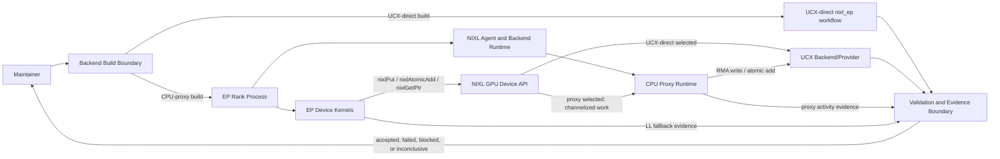

# Architecture — High-Level Design
> 001-integrate-nixl-ep-with-nixl-cp | feature | detailed

## System Context
System of interest: the existing NIXL EP example as executed by each EP rank process. Phase 1 extends that system so maintainers can build and run the same Python-facing `nixl_ep` workflow against either the current UCX-direct GPU Device API backend or the CPU-proxy GPU Device API backend.

External actors:
- EP maintainer: validates HT correctness, elastic LL correctness, and UCX-direct stability.
- NIXL CPU proxy maintainer: validates that EP exercises the CPU-proxy backend with one proxy worker and enough proxy channels for EP logical lanes.

Neighboring systems and containers:
- Build and CUDA device-linking environment: selects the GPU Device API backend at configure/build time.
- NIXL GPU Device API: presents backend-agnostic device operations to EP kernels.
- NIXL agent and backend host runtime: owns backend creation, memview preparation, and proxy enablement for each EP rank process.
- CPU proxy runtime: consumes GPU-originated proxy work records and submits transport operations on behalf of the GPU.
- UCX backend/provider: remains the transport provider used by both UCX-direct and CPU-proxy builds.
- Manual validation harnesses: HT validation, elastic LL validation, UCX-direct smoke/regression, and evidence classification.

Architecture drivers:
- Correctness-first Phase 1: acceptance is HT and elastic LL correctness through the CPU-proxy backend with required proxy/fallback evidence, plus an independent UCX-direct correctness signal.
- Stable public workflow: the `nixl_ep` module identity and user-facing workflow remain unchanged.
- Existing capability reuse: Phase 1 consumes the existing GPU Device API proxy backend, NIXL agent/proxy runtime, UCX backend/provider, CUDA device-linking support, and EP validation environment.
- Scope containment: no new daemon, scheduler, external service, third-party dependency, runtime backend selector, renamed Python module, proxy multi-worker scaling, or LL peer-pointer restoration is part of Phase 1.
- Evidence quality: correctness without proof that the intended proxy path ran is inconclusive, not accepted.

Stakeholder concerns and quality attributes:
- Maintainability: backend selection and proxy lifecycle should fit the existing EP rank process and NIXL agent boundaries.
- Backward compatibility: UCX-direct users should keep the existing workflow and have a separate small correctness smoke after proxy integration.
- Observability: validation must expose backend selection, proxy worker activity, and LL all-RDMA fallback evidence without relying on manual log archaeology.
- Failure clarity: invalid setup, missing proxy context, under-provisioned channels, unsupported topology, absent fallback evidence, and unapproved reduced-size validation should fail or be classified as inconclusive with an actionable reason.
- Performance neutrality for Phase 1: proxy throughput, tuning, and UCX-direct versus CPU-proxy comparison artifacts remain follow-ons.

Unresolved assumptions carried into LLD/tasks:
- The exact HT-compatible proxy smoke path is not yet selected; a full two-node HT RDMA run remains useful follow-on evidence, but a known true single-node fallback that violates current HT constraints is not accepted.
- Reduced-size validation criteria are not yet defined; reduced runs cannot count as Phase 1 evidence until those criteria are specified before validation.
- The concrete instrumentation surface for backend-selected evidence, proxy activity evidence, and LL fallback evidence remains to be chosen.
- Any future proxy-side peer-pointer design must define memory safety boundaries before returning device-usable peer pointers.

## Component Overview
| Component | Responsibility | Interfaces |
|---|---|---|
| Backend Build Boundary | Produces UCX-direct or CPU-proxy EP builds while preserving the existing `nixl_ep` workflow. | `gpu_device_api_backend`, CUDA device linking, `nixl_ep` module |
| EP Rank Process | Hosts the EP Python-facing workflow, per-rank host runtime, NIXL agent lifecycle, memview preparation, and validation entry points. | `nixl_ep`, EP HT validation, EP elastic LL validation |
| EP Device Kernels | Execute HT and LL work through backend-agnostic NIXL GPU Device API operations. | `nixlPut`, `nixlAtomicAdd`, `nixlGetPtr`, EP channel identifiers |
| NIXL Agent and Backend Runtime | Creates the selected UCX backend, enables proxy mode in proxy builds, starts agent-owned CPU proxy resources, and exposes proxy context to device code. | NIXL agent configuration, backend creation, proxy context publish/clear, memview preparation |
| CPU Proxy Runtime | Receives GPU proxy work records through N proxy channels, drains them with one Phase 1 proxy worker, resolves proxy memview indirection, and submits UCX operations. | proxy device context, proxy channels, proxy activity evidence |
| UCX Backend/Provider | Provides the transport implementation for RMA writes and atomics without Phase 1 proxy-internal scaling changes. | UCX backend/provider, RMA write, atomic add |
| Validation and Evidence Boundary | Runs accepted manual validation flows and classifies results as accepted, failed, blocked, or inconclusive based on correctness plus required evidence. | HT proxy smoke/topology, elastic LL suite/smoke, UCX-direct smoke, evidence record |

## Component Details
### Backend Build Boundary
**Responsibility:** Produces unambiguous UCX-direct and CPU-proxy EP builds through the existing build-time backend selection model, while keeping the Python-facing EP workflow stable.

**Inputs:** maintainer backend selection, existing build configuration, CUDA device-linking capability
**Outputs:** runnable UCX-direct EP build, runnable CPU-proxy EP build
**Dependencies:** NIXL GPU Device API backend selection, EP build target, CPU proxy device library

**Handles UCs:** UC-1, UC-4, UC-5

### EP Rank Process
**Responsibility:** Keeps Phase 1 inside each existing EP rank process and coordinates EP host runtime state, NIXL agent lifecycle, memview preparation, backend creation, and validation execution.

**Inputs:** selected build artifact, EP runtime configuration, local and remote memview inputs, validation run configuration
**Outputs:** EP device execution, backend lifecycle events, validation-visible status
**Dependencies:** Backend Build Boundary, NIXL Agent and Backend Runtime, EP Device Kernels

**Handles UCs:** UC-1, UC-2, UC-3, UC-4, UC-5

### EP Device Kernels
**Responsibility:** Preserve backend-agnostic HT and LL kernel behavior by issuing public NIXL GPU Device API operations rather than branching on proxy-specific kernel paths.

**Inputs:** EP work items, local and remote memview handles, channel identifiers, selected GPU Device API backend
**Outputs:** device-side RMA writes, device-side atomics, optional peer-pointer lookup result
**Dependencies:** NIXL GPU Device API, CPU Proxy Runtime or UCX-direct backend selected at build time

**Handles UCs:** UC-2, UC-3, UC-5

### NIXL Agent and Backend Runtime
**Responsibility:** Owns proxy enablement in proxy builds: enables the device proxy, starts one proxy worker with enough proxy channels for EP logical lanes, creates the UCX backend, publishes a usable proxy device context before device operations, and clears it before teardown.

**Inputs:** selected backend, proxy worker count, proxy channel count, memview preparation requests
**Outputs:** UCX backend instance, proxy runtime availability, proxy device context, proxy memview indirection
**Dependencies:** NIXL agent, CPU Proxy Runtime, UCX Backend/Provider

**Handles UCs:** UC-1, UC-2, UC-3, UC-5

### CPU Proxy Runtime
**Responsibility:** Provides the Phase 1 proxy execution path by accepting channelized GPU work records, resolving proxy memview indirection owned by the agent/proxy boundary, and submitting supported operations through UCX using a single proxy worker.

**Inputs:** proxy device context, channelized work records, proxy memview identifiers, one-worker configuration
**Outputs:** UCX transport submissions, proxy activity evidence, invalid channel/setup errors
**Dependencies:** NIXL Agent and Backend Runtime, UCX Backend/Provider

**Handles UCs:** UC-2, UC-3, UC-5

### UCX Backend/Provider
**Responsibility:** Remains the transport provider for Phase 1 and supports the RMA write and atomic operations needed by HT and the accepted elastic LL all-RDMA fallback.

**Inputs:** backend creation parameters, proxy-submitted work, UCX-direct device operations
**Outputs:** transport-level RMA writes and atomics, UCX-direct correctness behavior
**Dependencies:** NIXL Agent and Backend Runtime

**Handles UCs:** UC-2, UC-3, UC-4

### Validation and Evidence Boundary
**Responsibility:** Converts manual maintainer runs into trustworthy Phase 1 evidence by pairing correctness results with proof that the intended backend path, proxy activity, and fallback path were exercised.

**Inputs:** accepted HT proxy smoke or topology, accepted elastic LL suite or smoke, UCX-direct smoke/regression, proxy/fallback evidence signals
**Outputs:** accepted correctness evidence, actionable failures, inconclusive classifications
**Dependencies:** EP Rank Process, CPU Proxy Runtime, UCX Backend/Provider

**Handles UCs:** UC-2, UC-3, UC-4, UC-5

## Data Flow
Phase 1 uses build-time selection to produce either a UCX-direct or CPU-proxy `nixl_ep` build. In proxy builds, the EP rank process initializes the NIXL agent with device proxy enabled, creates the UCX backend, starts one agent-owned proxy worker with N proxy channels, publishes proxy context for device code, and prepares local/remote memviews through the existing boundary. HT and LL kernels continue to call the public NIXL GPU Device API operations. The selected backend determines whether operations go directly through UCX-direct device behavior or become channelized proxy work consumed by the CPU proxy runtime and submitted through UCX.

Validation is part of the architecture boundary. HT evidence requires correctness plus proxy activity through an accepted HT-compatible smoke or topology. Elastic LL evidence requires correctness, proxy backend selection, proxy worker activity, and an explicit all-RDMA fallback signal. UCX-direct stability requires a separate small correctness smoke. A run that passes correctness but lacks required evidence is inconclusive.

## Technology Selections
### Build-time GPU Device API backend selection
**Selected:** Use the existing build-time GPU Device API backend selection for UCX-direct versus CPU-proxy EP builds.
**Rationale:** It preserves the existing `nixl_ep` workflow, keeps the selected backend unambiguous, and avoids a new runtime selector or redesigned user entry point.
**Alternatives considered:** Runtime backend selector; renamed Python module for proxy mode; new external control plane; modifying the public EP workflow

### Existing NIXL GPU Device API wrappers
**Selected:** Keep HT and LL kernels backend-agnostic through public NIXL GPU Device API operations.
**Rationale:** The source material indicates the kernels already target backend-agnostic wrappers; Phase 1 should wire host/build/proxy lifecycle and validation evidence instead of forking kernels.
**Alternatives considered:** Proxy-specific kernel forks; bypassing the GPU Device API; restoring LL peer-pointer behavior before proxy correctness is proven

### Agent-owned CPU proxy runtime in each EP rank process
**Selected:** Enable device proxy in the existing NIXL agent lifecycle and run one proxy worker with N proxy channels in Phase 1.
**Rationale:** This keeps proxy ownership in the existing rank process, consumes current proxy capabilities, and avoids taking on proxy multi-worker and UCX worker/QP routing changes before correctness is established.
**Alternatives considered:** Separate proxy daemon; multiple proxy workers in Phase 1; channel-to-worker routing redesign; UCX worker/QP scaling as an initial requirement

### Proxy channel coverage for EP logical lanes
**Selected:** Require proxy channel count to cover the larger of the HT lane requirement and the LL local expert lane requirement, with under-provisioning treated as invalid setup.
**Rationale:** EP kernels enqueue work by channel. Phase 1 correctness depends on every logical lane having a valid proxy channel even when a single proxy worker drains all channels.
**Alternatives considered:** Worker count as the lane coverage proxy; accepting runtime enqueue failures as validation failures; silently truncating channel coverage

### Existing UCX backend/provider
**Selected:** Use the existing UCX backend/provider for Phase 1 transport operations without proxy-internal transport scaling changes.
**Rationale:** Phase 1 requires correctness for RMA write and atomic operations through the proxy path, while UCX worker/QP scaling and multi-thread safety validation are explicitly deferred.
**Alternatives considered:** New transport provider; modifying UCX worker routing in Phase 1; making UCX-direct versus proxy performance comparison a Phase 1 gate

### Elastic LL all-RDMA fallback with explicit evidence
**Selected:** Accept elastic LL all-RDMA fallback under CPU proxy only when validation records proxy selection, proxy worker activity, and an explicit fallback signal.
**Rationale:** Proxy-side `nixlGetPtr` peer-pointer restoration is out of Phase 1. Correctness is acceptable only if maintainers can prove the intended fallback path ran.
**Alternatives considered:** Treating inferred `nixlGetPtr` null behavior as sufficient; requiring NVLink/P2P restoration for Phase 1; accepting LL correctness without fallback evidence

### Manual validation evidence boundary
**Selected:** Treat Phase 1 validation as manual maintainer flows with deterministic evidence and explicit inconclusive classification.
**Rationale:** The use cases are manual maintainer actions, and the primary risk is false acceptance from silent UCX-direct fallback, missing proxy activity, unsupported topology, or ad hoc reduced-size runs.
**Alternatives considered:** CI or scheduler as a Phase 1 actor; correctness-only acceptance without path evidence; post-hoc log archaeology; timeout workarounds without pre-approved criteria

## Key Architectural Decisions
### Keep Phase 1 inside the existing EP rank process
No new daemon, external service, scheduler actor, control plane, or Python entry point is introduced. The EP rank process remains the container that owns the Python-facing workflow, host runtime, NIXL agent lifecycle, memview preparation, and kernel execution.

### Select backend at build time
UCX-direct and CPU-proxy are separate selected-backend builds. Maintainers should be able to validate each build without ambiguity, and UCX-direct stability remains an independent correctness signal rather than an artifact embedded in a later performance comparison.

### Preserve backend-agnostic kernels
HT and LL kernels continue to use public NIXL GPU Device API operations. CPU-proxy behavior is introduced through the selected backend and host/proxy lifecycle, not through proxy-specific kernel forks.

### Publish and clear proxy context as a runtime boundary
In proxy builds, the NIXL agent and EP host runtime must make a valid proxy device context available before device operations and clear that context before teardown. Failure to establish this boundary is setup failure, not a late device-side surprise.

### Use one proxy worker with N proxy channels
Phase 1 intentionally separates proxy channel coverage from proxy worker scaling. N channels cover EP logical lanes; one worker drains those channels. Multiple proxy workers, channel-to-worker mapping, UCX worker/QP selection, and multi-thread/progress validation remain Phase 1.5 follow-ons.

### Reuse existing memview boundaries
EP keeps its current local/remote memview preparation shape. The NIXL agent/proxy boundary owns proxy memview indirection, so Phase 1 should not redesign the memview model.

### Make evidence a first-class acceptance boundary
HT and elastic LL correctness are necessary but not sufficient. Accepted proxy evidence must show the CPU-proxy backend path was exercised. Accepted LL evidence must additionally show the all-RDMA fallback was used. Passing runs with missing evidence are inconclusive.

### Reject known-invalid HT evidence paths
The known true single-node HT fallback is not valid Phase 1 evidence under the current HT constraints unless a compatible smoke/test path is explicitly added. A real two-node HT RDMA run remains useful follow-on evidence, but Phase 1 may use an accepted HT-compatible proxy smoke once defined.

### Preserve UCX-direct correctness separately
The UCX-direct workflow must remain stable for existing users. A small UCX-direct smoke/regression is required as an independent stability signal; later UCX-direct versus CPU-proxy comparison output does not replace it.

### Classify invalid setup separately from inconclusive evidence
Missing proxy setup, missing proxy context, unsupported topology, under-provisioned channels, or silent UCX-direct fallback should fail early with an actionable reason. Correctness pass without required proxy/fallback evidence should be inconclusive. Timeout under the one-worker model is inconclusive unless pre-approved reduced-size criteria were defined before validation.

### Keep follow-ons visible but outside Phase 1 acceptance
Phase 1.5 owns proxy multi-worker scaling, channel-to-worker mapping, UCX worker/QP selection, and proxy performance work. Phase 2 owns any proxy-side peer-pointer or NVLink/P2P restoration investigation, and that work must define memory safety boundaries before exposing device-usable peer pointers.

### Treat stale plan references as non-authoritative implementation detail
The staged integration plan remains useful source material, but corrected goal/use-case artifacts define the Phase 1 acceptance boundary. Any absent or stale plan examples should not override the current correctness-first scope, evidence requirements, or follow-on separation.

## UC Traceability
| UC | Component(s) |
|---|---|
| UC-1: Build EP for UCX-direct or CPU-proxy backend | Backend Build Boundary, EP Rank Process, NIXL Agent and Backend Runtime |
| UC-2: Validate HT correctness through CPU proxy | EP Rank Process, EP Device Kernels, NIXL Agent and Backend Runtime, CPU Proxy Runtime, UCX Backend/Provider, Validation and Evidence Boundary |
| UC-3: Validate elastic LL correctness through CPU-proxy all-RDMA fallback | EP Rank Process, EP Device Kernels, NIXL Agent and Backend Runtime, CPU Proxy Runtime, UCX Backend/Provider, Validation and Evidence Boundary |
| UC-4: Preserve UCX-direct correctness | Backend Build Boundary, EP Rank Process, UCX Backend/Provider, Validation and Evidence Boundary |
| UC-5: Fail clearly on invalid proxy validation setup | Backend Build Boundary, EP Rank Process, EP Device Kernels, NIXL Agent and Backend Runtime, CPU Proxy Runtime, Validation and Evidence Boundary |
