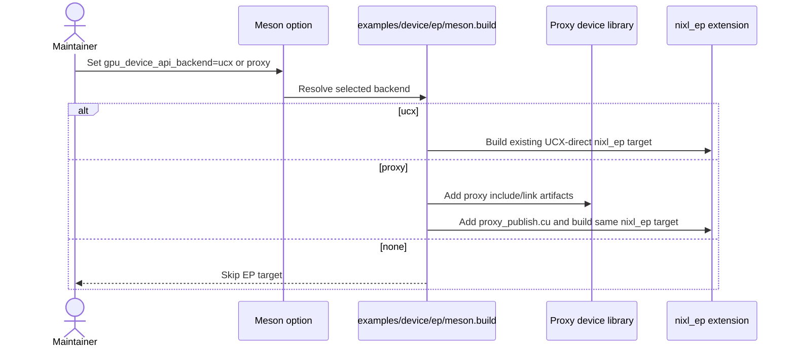
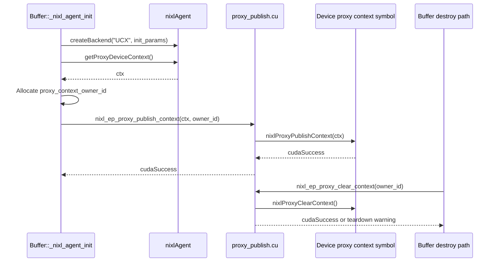
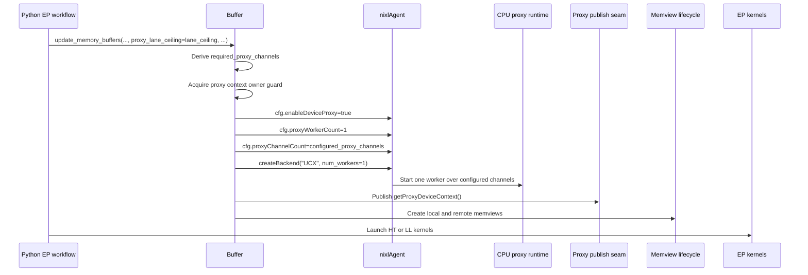
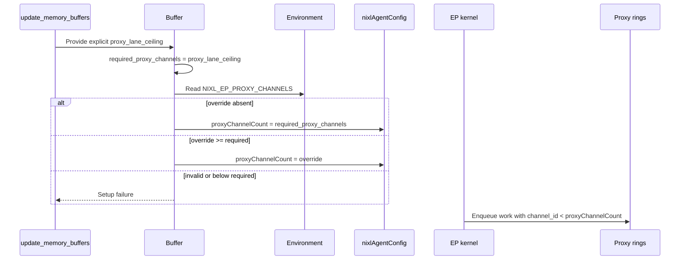
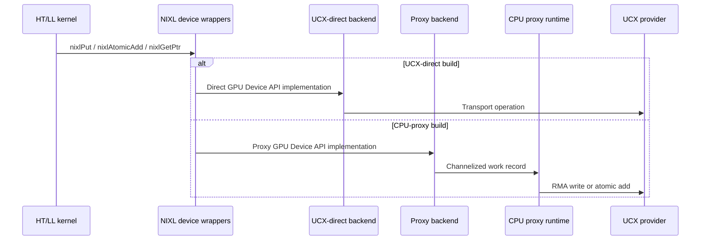
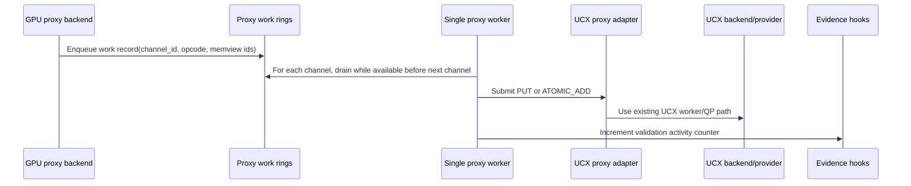
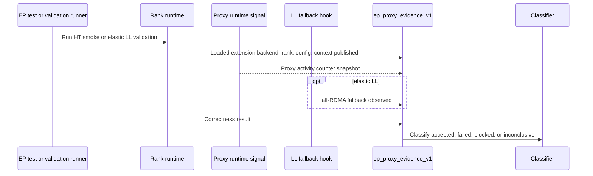
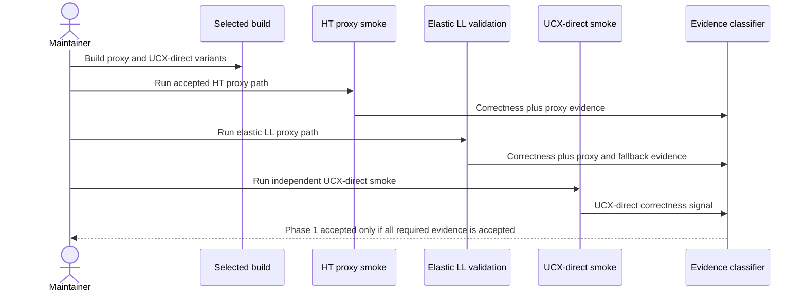
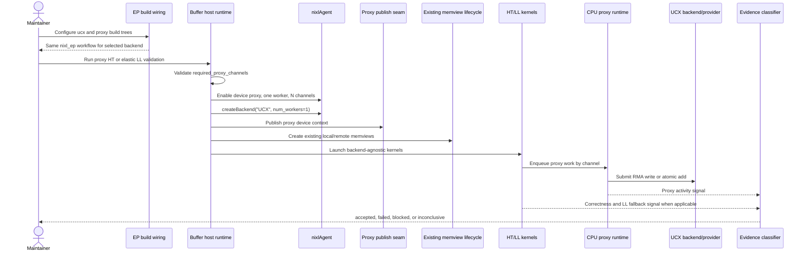

# Architecture — Low-Level Design
> 001-integrate-nixl-ep-with-nixl-cp | feature | detailed

## Module: EP Backend Build Wiring

**Purpose:** Produce selected-backend `nixl_ep` builds for UCX-direct and CPU-proxy without changing the Python-facing module identity or public workflow.

### Public Interface
#### Meson selected-backend EP target
**Input:** Global `gpu_device_api_backend` option, existing CUDA device-linking setup, EP source list, GPU Device API compile arguments, existing proxy include/link artifacts.
**Output:** A runnable `nixl_ep` extension for `gpu_device_api_backend=ucx` or `gpu_device_api_backend=proxy`; no EP build for `none`.
**Error contracts:**
- `EP_BUILD_UNSUPPORTED_BACKEND`: If the backend is neither `ucx`, `proxy`, nor `none`, EP configuration fails with an actionable build-time error.
- `EP_BUILD_MISSING_PROXY_LINK`: If proxy mode cannot access `nixl_gpu_proxy_inc_dirs` or `nixl_gpu_proxy_lib`, proxy configuration fails rather than producing an extension that cannot publish proxy context.
- `EP_BUILD_ENTRYPOINT_DRIFT`: If proxy mode requires a renamed Python module or different user-facing workflow, the build does not satisfy Phase 1.

#### Proxy-only source inclusion
**Input:** Selected backend from `gpu_device_api_backend`.
**Output:** `examples/device/ep/csrc/kernels/proxy_publish.cu` is compiled and linked only in proxy builds; UCX-direct builds do not include the proxy publish translation unit.
**Error contracts:**
- `EP_BUILD_UCX_PROXY_CODE_LEAK`: If a UCX-direct build picks up proxy publish symbols or proxy link requirements, the change is a compatibility regression.
- `EP_BUILD_PROXY_TU_ABSENT`: If a proxy build omits the publish/clear translation unit, runtime proxy context setup cannot be accepted.

#### Loaded extension backend introspection
**Input:** Imported `nixl_ep` extension from the validation process.
**Output:** `nixl_ep.get_gpu_device_api_backend()` returns the compile-time selected backend from the loaded extension as `ucx` or `proxy`.
**Error contracts:**
- `EP_BACKEND_INTROSPECTION_MISSING`: If the loaded extension does not expose the selected-backend getter, proxy evidence is inconclusive.
- `EP_BACKEND_EVIDENCE_OUT_OF_BAND`: Evidence must not source `backend` from build directory names, run scripts, environment variables, or maintainer notes; it must call the loaded extension's compile-time getter.

### Sequence: Configure selected EP build


### Error Handling
The build gate replaces the current UCX-only hard error with an allow-list for `ucx` and `proxy`, while preserving the existing `none` skip behavior. Build failures should occur during configuration or link, not later at import time. The `nixl_ep` module name remains the compatibility contract for both selected-backend builds.

### Data Schemas
#### Build selection contract
```yaml
ep_build_selection_v1:
  backend: ucx | proxy | none
  module_name: nixl_ep
  extension_backend_api: get_gpu_device_api_backend
  evidence_backend_source: loaded_extension_compile_time_backend
  proxy_publish_tu_compiled: true | false
  proxy_device_library_linked: true | false
```

## Module: Proxy Context Publish/Clear CUDA Seam

**Purpose:** Provide a narrow host-callable CUDA seam that publishes the agent-owned proxy device context to device code and clears it before teardown.

### Public Interface
#### `nixl_ep_proxy_publish_context`
**Input:** `void *ctx` returned by `nixlAgent::getProxyDeviceContext()` after `createBackend("UCX", ...)` in a proxy build, plus the owning `Buffer`'s process-local `owner_id`.
**Output:** `cudaSuccess` when the current CUDA context has no different active proxy `Buffer` owner, the device-side proxy context is published, and subsequent GPU Device API proxy calls can load it.
**Error contracts:**
- `EP_PROXY_CONTEXT_NULL`: A null `ctx` is setup failure.
- `EP_PROXY_CONTEXT_PUBLISH_FAILED`: Any non-`cudaSuccess` publish result is setup failure and blocks kernel launch for proxy validation.
- `EP_PROXY_CONTEXT_WRONG_BACKEND`: Calling this seam in a UCX-direct build is a build or guard error; UCX-direct builds should not compile the translation unit.
- `EP_PROXY_CONTEXT_ALREADY_ACTIVE`: Publishing while a different proxy `Buffer` owns the current CUDA context's global proxy context is setup failure.

#### `nixl_ep_proxy_clear_context`
**Input:** The owning `Buffer`'s `owner_id`; called during proxy teardown before agent/proxy resources are released.
**Output:** `cudaSuccess` when the caller owns the current CUDA context's published proxy context and the device-side proxy context is cleared.
**Error contracts:**
- `EP_PROXY_CONTEXT_CLEAR_FAILED`: Clear failure is surfaced as a teardown warning unless the surrounding EP teardown pattern requires fatal teardown.
- `EP_PROXY_CONTEXT_LATE_CLEAR`: Clearing after agent/proxy teardown is invalid because kernels could observe stale context.
- `EP_PROXY_CONTEXT_OWNER_MISMATCH`: A non-owning `Buffer` must not clear the global proxy context; the mismatch is reported and the context remains bound to its owner.

### Sequence: Publish and clear proxy context


### Error Handling
Publish happens after backend creation and before memview-backed device operations. Because the proxy device context symbol is global for the current CUDA context, Phase 1 enforces one active proxy `Buffer` owner per CUDA context in a rank process. A second proxy `Buffer` may be constructed only after the first owner clears the context, or setup fails with `EP_PROXY_CONTEXT_ALREADY_ACTIVE`. Clear happens before agent/proxy teardown and is owner-aware so one `Buffer` cannot clear another `Buffer`'s published context. A missing, failed, or non-owned publish is an early setup error, not a device-side surprise from `nixlPut` returning `NIXL_ERR_NOT_SUPPORTED`. The exact C++ mechanism (`std::runtime_error`, `EP_HOST_ASSERT`, or local teardown logging) should match the surrounding EP style.

### Data Schemas
#### Publish seam signatures
```c++
cudaError_t nixl_ep_proxy_publish_context(void *ctx, uint64_t owner_id);
cudaError_t nixl_ep_proxy_clear_context(uint64_t owner_id);
```

## Module: EP Host Runtime Proxy Lifecycle

**Purpose:** Enable the CPU proxy inside the existing `Buffer` lifecycle for proxy builds while preserving the existing UCX-direct host runtime behavior.

### Public Interface
#### `Buffer::_nixl_agent_init` proxy configuration
**Input:** Selected proxy build macro, explicit allocation-time `proxy_lane_ceiling` captured by `Buffer::update_memory_buffers(...)`, optional `NIXL_EP_PROXY_CHANNELS` override, existing UCX `init_params`.
**Output:** NIXL agent configuration with device proxy enabled, one proxy worker, enough proxy channels, UCX backend created with `num_workers=1`, and proxy context published.
**Error contracts:**
- `EP_PROXY_LANE_CEILING_MISSING`: Proxy validation setup did not provide an explicit positive `proxy_lane_ceiling`.
- `EP_PROXY_CHANNELS_UNDERPROVISIONED`: If configured proxy channels are below `required_proxy_channels`, setup fails before kernels run.
- `EP_PROXY_CHANNELS_INVALID_OVERRIDE`: If `NIXL_EP_PROXY_CHANNELS` is present but cannot be parsed as a positive integer, setup fails.
- `EP_PROXY_AGENT_INIT_FAILED`: If agent or backend creation fails in proxy mode, validation fails with setup error.
- `EP_PROXY_CONTEXT_UNAVAILABLE`: If `getProxyDeviceContext()` returns null after backend creation, setup fails.
- `EP_PROXY_CONTEXT_ALREADY_ACTIVE`: If another proxy `Buffer` owns the current CUDA context's published proxy context, setup fails before memviews or kernels run.

#### `Buffer` teardown proxy cleanup
**Input:** Existing `Buffer` destroy path and proxy build state.
**Output:** Device proxy context cleared before agent/proxy resources are released; memview teardown remains on the existing path.
**Error contracts:**
- `EP_PROXY_TEARDOWN_ORDER`: If proxy context clear is attempted after agent destruction, teardown order is invalid.
- `EP_PROXY_TEARDOWN_WARNING`: Clear failure should be reported, but does not convert already-finished correctness into accepted proxy evidence if setup or evidence was incomplete.

### Sequence: Proxy rank initialization


### Error Handling
Proxy lifecycle setup errors are classified before validation runs. The proxy build must not silently fall back to UCX-direct. UCX-direct builds keep the existing `_nixl_agent_init` behavior and do not set proxy config, publish context, or require proxy channel overrides.

### Data Schemas
#### Proxy runtime configuration
```yaml
ep_proxy_runtime_config_v1:
  backend: proxy
  proxy_worker_count: 1
  proxy_channel_count: <configured_proxy_channels>
  required_proxy_channels: <proxy_lane_ceiling>
  ucx_num_workers: 1
  proxy_lane_ceiling_source: explicit_update_memory_buffers_parameter
  proxy_context_owner_id: <process_local_owner_id>
  single_active_proxy_buffer_enforced: true
  proxy_context_published: true | false
  override_env:
    name: NIXL_EP_PROXY_CHANNELS
    state: absent | accepted | invalid | underprovisioned
```

## Module: Proxy Channel Sizing and Ordering Contract

**Purpose:** Ensure the CPU proxy exposes enough work rings for EP logical lanes while keeping Phase 1 worker scaling intentionally fixed at one proxy worker.

### Public Interface
#### Required channel derivation
**Input:** The explicit `proxy_lane_ceiling` passed through `Buffer::update_memory_buffers(...)`. HT supplies its proxy lane requirement, normally `num_qps_per_rank`. Elastic LL supplies its local expert lane count. A shared `Buffer` used by both paths supplies the maximum of those lane requirements.
**Output:** `required_proxy_channels`, the minimum valid proxy channel count for the current EP allocation.
**Error contracts:**
- `EP_PROXY_REQUIRED_CHANNELS_ZERO`: A zero or missing lane ceiling is invalid for proxy validation.
- `EP_PROXY_CHANNELS_BELOW_LANE_CEILING`: Configured channels below the allocation-time lane ceiling fail setup.
- `EP_PROXY_CHANNEL_CONCEPT_MIXUP`: `NIXL_EP_NUM_CHANNELS` must not be reused as a proxy work-ring override because it configures UCX-direct device channels, not CPU proxy rings.
- `EP_PROXY_LANE_CEILING_OVERLOAD_FORBIDDEN`: `num_experts_per_rank` remains expert-topology metadata and must not be silently reused as the proxy lane ceiling in proxy builds.

#### Python/C++ lane-ceiling boundary
**Input:** Python `Buffer.update_memory_buffers(..., num_experts_per_rank, proxy_lane_ceiling=...)` and the C++ `Buffer` storage backing that call.
**Output:** C++ stores `proxy_lane_ceiling` separately from `max_experts_per_rank` and uses only `proxy_lane_ceiling` for `required_proxy_channels`.
**Error contracts:**
- `EP_PROXY_LANE_CEILING_MISSING`: Proxy builds that intend to run HT or elastic LL proxy validation must fail setup if the explicit parameter is absent or zero.
- `EP_PROXY_LANE_CEILING_BELOW_REQUIRED`: If the Python caller derives a value below the known HT or LL lane requirement, validation setup is invalid and must not proceed to device enqueue.

#### Optional proxy channel override
**Input:** `NIXL_EP_PROXY_CHANNELS`.
**Output:** If absent, `proxyChannelCount = required_proxy_channels`; if present and greater than or equal to the required count, `proxyChannelCount = override`.
**Error contracts:**
- `EP_PROXY_CHANNELS_PARSE_ERROR`: Non-integer, negative, or zero override values are setup errors.
- `EP_PROXY_CHANNELS_UNDERPROVISIONED`: Override below `required_proxy_channels` is setup error.

#### Per-channel ordering contract
**Input:** Device operations that share a `channel_id`, including data PUT followed by flag or atomic operations.
**Output:** Phase 1 relies only on per-channel enqueue order. A single proxy worker drains all channels and submits through one UCX worker.
**Error contracts:**
- `EP_PROXY_CROSS_CHANNEL_ORDER_UNSUPPORTED`: No cross-channel ordering guarantee is introduced.
- `EP_PROXY_ATOMIC_RETRY_UNSAFE`: Transport or proxy failures for atomics must not be hidden by transparent idempotent retry.

### Sequence: Configure and validate proxy channels


### Error Handling
Under-provisioning fails before kernels run because later device enqueue failures would be harder to diagnose and cannot become accepted evidence. Phase 1 explicitly separates channel coverage from worker scaling: one worker may be slow, but it is valid when all required channels exist. Timeouts caused by the one-worker model are inconclusive unless reduced-size criteria were approved before validation.

### Data Schemas
#### Channel sizing record
```yaml
ep_proxy_channel_sizing_v1:
  required_proxy_channels: <positive_integer>
  configured_proxy_channels: <positive_integer>
  source: explicit_proxy_lane_ceiling_parameter
  num_experts_per_rank_semantics: expert_topology_only
  override:
    env: NIXL_EP_PROXY_CHANNELS
    value: <integer_or_absent>
  ordering_contract:
    per_channel_fifo_required: true
    cross_channel_ordering_required: false
```

## Module: EP Memview and Device Operation Contract

**Purpose:** Preserve existing EP local/remote memview preparation and backend-agnostic device kernels while routing proxy builds through the CPU proxy backend selected at build time.

### Public Interface
#### Existing memview lifecycle
**Input:** Existing `_nixl_ep_memory_views_create()` and `_nixl_ep_memory_views_destroy()` calls, local and remote buffer metadata, selected backend.
**Output:** Existing memview handles remain usable by HT and LL kernels; proxy memview indirection is owned by the NIXL agent/proxy boundary.
**Error contracts:**
- `EP_MEMVIEW_CREATE_FAILED`: Existing memview preparation failures remain validation-visible setup failures.
- `EP_MEMVIEW_PROXY_REGISTRY_MISSING`: If proxy mode cannot resolve proxy memview IDs, proxy validation fails; the EP memview model is not redesigned in Phase 1.

#### Backend-agnostic kernel calls
**Input:** HT and LL kernel work items, memview handles, `channel_id`, selected GPU Device API backend.
**Output:** Kernels continue to call `nixlPut`, `nixlAtomicAdd`, and `nixlGetPtr`; proxy builds enqueue supported operations as proxy work records.
**Error contracts:**
- `EP_KERNEL_PROXY_FORK`: Proxy-specific HT or LL kernel forks are out of Phase 1 scope.
- `EP_DEVICE_STATUS_FAILURE`: Device `nixl_status_t` failures remain checked by existing device assertions or equivalent validation-visible failure.
- `EP_PROXY_GETPTR_FAST_PATH_DEFERRED`: Proxy `nixlGetPtr` peer-pointer restoration is not required; all-RDMA fallback is accepted only with explicit evidence.

### Sequence: Device operations in selected backend


### Error Handling
The LLD keeps memview and kernel contracts stable. Proxy support is introduced through build selection, agent configuration, context publishing, and validation evidence. Unsupported proxy operations or failed proxy submissions are correctness failures or inconclusive validation outcomes, not silently accepted success.

### Data Schemas
#### Device operation contract
```yaml
ep_device_operation_contract_v1:
  kernel_paths:
    ht: backend_agnostic
    ll: backend_agnostic
  required_operations:
    - nixlPut
    - nixlAtomicAdd
    - nixlGetPtr
  proxy_phase1_behavior:
    put: proxy_submitted_ucx_rma_write
    atomic_add: proxy_submitted_ucx_atomic_add
    get_ptr: null_or_unavailable_peer_pointer_for_all_rdma_fallback
```

## Module: Proxy Runtime and UCX Provider Boundary

**Purpose:** Consume existing CPU proxy and UCX backend capabilities for Phase 1 without changing UCX worker/QP routing, multi-worker scaling, or proxy scheduling semantics. The only proxy-internal Phase 1 exception is a deterministic validation-only activity counter needed to prove the proxy path ran.

### Public Interface
#### Existing proxy submission boundary
**Input:** Published proxy device context, channelized GPU work records, proxy memview identifiers, configured one-worker proxy runtime.
**Output:** Proxy worker submits supported RMA write and atomic add operations through the existing UCX backend/provider. Current worker scheduling scans assigned channels and drains a channel while work remains available before moving to the next channel; Phase 1 does not claim fair round-robin service.
**Error contracts:**
- `EP_PROXY_ACTIVITY_ABSENT`: Runtime creation without work submission activity is not accepted proxy evidence.
- `EP_PROXY_SUBMIT_FAILED`: Proxy submit or completion failure is validation-visible failure unless evidence rules classify the run as inconclusive.
- `EP_PROXY_UNSUPPORTED_OPCODE`: Unsupported device operation through proxy fails validation; Phase 1 requires PUT and ATOMIC_ADD support.

#### Deterministic proxy activity evidence hook
**Input:** Proxy worker submission path during a validation run, with evidence collection reset or snapshotted before HT or elastic LL execution.
**Output:** A validation-visible proxy activity count from the loaded runtime, incremented when the proxy worker submits a supported work record to the backend during the run.
**Error contracts:**
- `EP_PROXY_ACTIVITY_COUNTER_UNAVAILABLE`: If no deterministic counter or equivalent structured signal is exposed, proxy correctness evidence is inconclusive.
- `EP_PROXY_ACTIVITY_LOG_ONLY`: Debug logs, runtime creation messages, and build/run-script assertions are not accepted activity evidence.
- `EP_PROXY_ACTIVITY_SCOPE_CREEP`: The counter must not change proxy scheduling, retry, transport, or production fast-path semantics beyond low-cost observation.

#### Deferred worker scaling boundary
**Input:** Any request to use multiple proxy workers, channel-to-worker routing, UCX `num_workers=N`, worker-id submit plumbing, or UCX multi-thread validation.
**Output:** Deferred Phase 1.5 task, not part of Phase 1 acceptance.
**Error contracts:**
- `EP_PROXY_MULTIWORKER_SCOPE_CREEP`: Multi-worker proxy scaling is out of scope for this LLD's Phase 1 implementation surface.
- `EP_UCX_QP_ROUTING_DEFERRED`: UCX worker/QP selection changes are deferred until after Phase 1 correctness.

#### Phase 1 worker scheduling contract
**Input:** One proxy worker assigned to the configured proxy channels.
**Output:** Validation and performance interpretation use the current drain-until-empty channel scan semantics.
**Error contracts:**
- `EP_PROXY_FAIRNESS_ASSUMPTION_INVALID`: Designs, tests, or evidence classifiers must not assume bounded or fair round-robin polling unless a later task explicitly changes the worker.
- `EP_PROXY_HOT_CHANNEL_STARVATION_INCONCLUSIVE`: Timeouts or severe tail latency under a hot-channel workload are inconclusive or performance-follow-on evidence, not proof of correct fair scheduling.

### Sequence: CPU proxy submit path


### Error Handling
Phase 1 does not retry failed atomics as if they were idempotent. It also does not infer proxy execution from runtime startup alone. The minimum accepted signal is a deterministic activity count greater than zero during the HT or LL run being validated. Current single-worker scheduling can starve colder channels while a hot channel remains non-empty, so Phase 1 validation must not interpret a timeout under skewed multi-channel load as a fair-service result; completed correctness runs with required evidence can be accepted, while starvation-shaped timeouts are inconclusive or validation-blocked unless a later task adds bounded polling.

### Data Schemas
#### Proxy activity signal
```yaml
ep_proxy_activity_signal_v1:
  backend: proxy
  rank: <rank>
  proxy_worker_count: 1
  proxy_channel_count: <configured_proxy_channels>
  activity_source: proxy_worker_submission_counter
  submitted_work_count: <non_negative_integer>
  submitted_work_observed: true | false
  scheduler: drain_channel_while_available
  fair_round_robin: false
  observed_during: ht | elastic_ll | other
```

## Module: Validation Evidence Surface

**Purpose:** Convert manual maintainer validation into deterministic evidence records that distinguish accepted, failed, blocked, and inconclusive Phase 1 outcomes.

### Public Interface
#### `ep_proxy_evidence_v1` record
**Input:** Backend selection queried from the loaded `nixl_ep` extension, rank, proxy runtime config, channel sizing, context publish result, proxy activity signal, LL fallback signal, correctness result, validation path metadata.
**Output:** Structured evidence emitted by EP validation code or tests; not a production public API.
**Error contracts:**
- `EP_EVIDENCE_BACKEND_MISSING`: Proxy evidence without backend selection is inconclusive.
- `EP_EVIDENCE_BACKEND_NOT_EXTENSION_SOURCED`: Backend evidence sourced from a build directory, environment variable, run script, or maintainer note is inconclusive.
- `EP_EVIDENCE_ACTIVITY_MISSING`: Correctness pass without proxy activity is inconclusive.
- `EP_EVIDENCE_LL_FALLBACK_MISSING`: Elastic LL correctness pass without explicit all-RDMA fallback evidence is inconclusive.
- `EP_EVIDENCE_CORRECTNESS_FAILED`: Correctness failure is failed evidence, not inconclusive success.
- `EP_EVIDENCE_DEBUG_LOG_ONLY`: Manual debug-log archaeology is not accepted evidence.

#### LL all-RDMA fallback evidence hook
**Input:** LL execution under proxy backend where `nixlGetPtr` does not provide a device-usable peer pointer and the all-RDMA path is selected.
**Output:** EP-visible fallback branch log, counter, or structured field recorded during the LL run.
**Error contracts:**
- `EP_LL_FALLBACK_INFERRED_ONLY`: Inferring fallback solely from correctness or known proxy `nixlGetPtr` behavior is inconclusive.
- `EP_LL_FAST_PATH_REQUIRED`: Requiring restored proxy peer pointers for Phase 1 is out of scope.

### Sequence: Build accepted proxy evidence


### Error Handling
Evidence is part of the acceptance boundary. A correctness pass can still be inconclusive when required proxy or fallback evidence is absent. Invalid setup such as missing proxy context or under-provisioned channels fails before evidence classification. A timeout under the one-worker model is inconclusive or validation-blocked unless pre-approved reduced-size criteria exist before the run.

### Data Schemas
#### Proxy evidence record
```yaml
ep_proxy_evidence_v1:
  backend: proxy | ucx
  backend_source: loaded_extension_compile_time_backend
  loaded_extension_backend_api: get_gpu_device_api_backend
  rank: <rank>
  validation_path: ht_proxy_smoke | ht_two_node_rdma | elastic_ll | ucx_direct_smoke
  proxy_worker_count: 1
  proxy_channel_count: <configured>
  required_proxy_channels: <derived>
  proxy_lane_ceiling_source: explicit_update_memory_buffers_parameter
  proxy_context_owner_id: <process_local_owner_id_or_not_applicable>
  proxy_context_published: true | false
  proxy_activity_observed: true | false
  proxy_activity_source: proxy_worker_submission_counter
  proxy_activity_submitted_work_count: <non_negative_integer>
  proxy_scheduler: drain_channel_while_available
  ll_all_rdma_fallback_observed: true | false | not_applicable
  correctness: pass | fail | not_run
  classification: accepted | failed | blocked | inconclusive
  reason: "<short actionable reason>"
```

## Module: EP Validation Harnesses

**Purpose:** Provide Phase 1 validation seams for HT proxy correctness, elastic LL proxy all-RDMA correctness, invalid setup checks, and independent UCX-direct stability.

### Public Interface
#### HT-compatible proxy smoke
**Input:** Proxy build, valid proxy runtime config, explicit HT-compatible smoke under `examples/device/ep/tests/` or an accepted two-node HT RDMA topology.
**Output:** HT correctness pass plus `ep_proxy_evidence_v1` showing loaded-extension proxy backend selection, context publish, proxy activity, and accepted validation path metadata.
**Error contracts:**
- `EP_HT_SINGLE_NODE_FALLBACK_INVALID`: The known true single-node fallback with fewer local ranks or `UCX_TLS=^cuda_ipc` is rejected or inconclusive unless a compatible smoke/test path is explicitly added.
- `EP_HT_PROXY_ACTIVITY_MISSING`: HT correctness without proxy activity is inconclusive.
- `EP_HT_TIMEOUT_REDUCED_UNAPPROVED`: Reduced-size or timeout workaround evidence is inconclusive unless criteria were defined before validation.

#### Elastic LL proxy validation
**Input:** Proxy build, elastic LL suite or accepted smoke, proxy activity signal, explicit LL all-RDMA fallback signal.
**Output:** LL correctness pass plus accepted proxy all-RDMA fallback evidence.
**Error contracts:**
- `EP_LL_PROXY_ACTIVITY_MISSING`: LL correctness without proxy activity is inconclusive.
- `EP_LL_FALLBACK_SIGNAL_MISSING`: LL correctness without explicit fallback evidence is inconclusive.
- `EP_LL_PEER_POINTER_DEFERRED`: Missing NVLink/P2P fast-path restoration is not a Phase 1 failure when fallback evidence is present.

#### UCX-direct correctness smoke
**Input:** UCX-direct build using the unchanged `nixl_ep` workflow and a small correctness smoke/regression.
**Output:** Independent UCX-direct stability signal.
**Error contracts:**
- `EP_UCX_DIRECT_REGRESSION`: UCX-direct smoke failure blocks Phase 1.
- `EP_UCX_COMPARISON_ONLY`: A later performance comparison does not replace the independent UCX-direct correctness smoke.

#### Invalid setup tests
**Input:** Negative configurations such as missing proxy context, overlapping proxy `Buffer` owners, missing explicit proxy lane ceiling, under-provisioned channels, absent proxy activity, out-of-band backend evidence, missing LL fallback signal, unsupported HT topology, or undefined reduced-size timeout workaround.
**Output:** Setup failure or inconclusive classification with actionable reason.
**Error contracts:**
- `EP_SETUP_SILENT_UCX_FALLBACK`: Silent UCX-direct fallback invalidates proxy evidence.
- `EP_SETUP_BACKEND_OUT_OF_BAND`: Backend evidence not queried from the loaded extension is inconclusive even if correctness passes.
- `EP_SETUP_UNSUPPORTED_TOPOLOGY`: Unsupported topology is rejected or validation-blocked.
- `EP_SETUP_MISSING_REASON`: Failure or inconclusive outcomes must include an actionable reason.

### Sequence: Phase 1 validation flow


### Error Handling
Validation harnesses must classify outcomes rather than letting ambiguous runs appear green. Missing evidence is inconclusive, invalid setup is failed or blocked with reason, and performance comparison remains follow-on. The exact HT smoke name, command shape, and reduced-size validation floor remain unresolved assumptions for tasks; they must be defined before such runs are counted as accepted evidence.

### Data Schemas
#### Validation classification rules
```yaml
ep_validation_classification_v1:
  ht_proxy:
    accepted_when:
      - correctness == pass
      - backend == proxy
      - backend_source == loaded_extension_compile_time_backend
      - proxy_context_published == true
      - proxy_activity_observed == true
      - validation_path in [ht_proxy_smoke, ht_two_node_rdma]
    inconclusive_when:
      - correctness == pass and proxy_activity_observed == false
      - unsupported_single_node_fallback == true
      - reduced_size_criteria_preapproved == false
  elastic_ll_proxy:
    accepted_when:
      - correctness == pass
      - backend == proxy
      - backend_source == loaded_extension_compile_time_backend
      - proxy_activity_observed == true
      - ll_all_rdma_fallback_observed == true
    inconclusive_when:
      - correctness == pass and ll_all_rdma_fallback_observed != true
  ucx_direct:
    accepted_when:
      - correctness == pass
      - backend == ucx
      - backend_source == loaded_extension_compile_time_backend
```

## Cross-Module Interactions
Phase 1 is implemented as a selected-backend build and runtime lifecycle change inside the existing EP rank process. `examples/device/ep/meson.build` produces the same `nixl_ep` module for UCX-direct and CPU-proxy builds. In proxy builds it links the existing proxy device library and includes the proxy publish translation unit. UCX-direct builds retain the existing module and workflow and must not depend on proxy publish code.

The runtime order is strict. `Buffer.update_memory_buffers(...)` receives an explicit `proxy_lane_ceiling` separate from `num_experts_per_rank`; the C++ `Buffer` stores that value separately and uses it to derive `required_proxy_channels`. `Buffer::_nixl_agent_init()` validates `NIXL_EP_PROXY_CHANNELS` if present, configures one proxy worker and enough channels, creates the UCX backend with one worker, acquires the one-active-proxy-`Buffer` guard for the current CUDA context, publishes the owner-bound proxy device context, then proceeds through the existing memview creation path. HT and LL kernels continue using backend-agnostic NIXL GPU Device API wrappers. In proxy builds, work is enqueued by channel and drained by the single CPU proxy worker into the existing UCX provider using the current drain-until-empty channel scan semantics, not fair round-robin polling.

Validation is not a separate afterthought. The same implementation must expose deterministic evidence for backend selection from the loaded extension's compile-time getter, context publish ownership, channel coverage from the explicit lane ceiling, proxy activity from the validation activity counter, LL all-RDMA fallback, correctness result, and classification. The `ep_proxy_evidence_v1` record is a validation/test artifact, not a public production API. Existing lower-level proxy tests remain useful for publish, clear, enqueue, owner mismatch, and channel behavior; EP-level tests cover selected-backend build/import, lifecycle setup, channel override validation, HT proxy smoke, elastic LL fallback evidence, and independent UCX-direct correctness.

Migration steps are intentionally small and ordered: first update the EP build gate, proxy-only source/link wiring, and loaded-extension backend introspection; next add the owner-aware CUDA publish/clear seam; then guard proxy lifecycle setup in `nixl_ep.cpp`; then add explicit proxy lane-ceiling capture and channel override validation; then add the validation-only proxy activity counter, LL fallback evidence, and tests. CPU proxy scheduling changes, UCX worker/QP routing, multi-worker mapping, performance comparison artifacts, and proxy `nixlGetPtr` peer-pointer restoration remain outside Phase 1.

Unresolved assumptions that tasks must keep explicit:
- The exact HT-compatible proxy smoke name and command are not fixed here; it must live under `examples/device/ep/tests/` or use an accepted two-node HT RDMA topology, and the known true single-node fallback remains rejected or inconclusive.
- Reduced-size validation criteria are still undefined; reduced runs cannot count as accepted Phase 1 evidence until those criteria are defined before validation.
- Proxy activity evidence is a required Phase 1 scope exception: add the smallest deterministic submission counter needed for `ep_proxy_evidence_v1`; logs alone are not accepted evidence.
- The current proxy worker does not provide fair round-robin channel service. Validation timeouts under hot-channel skew are inconclusive unless a later task changes the worker or defines bounded criteria before validation.
- The exact host error mechanism should match surrounding EP style while preserving the required behavior: invalid setup fails before kernels run, and missing evidence is inconclusive.
- Any future proxy peer-pointer design must define rank, memview, bounds, lifetime, and authorization safety before returning device-usable pointers.


