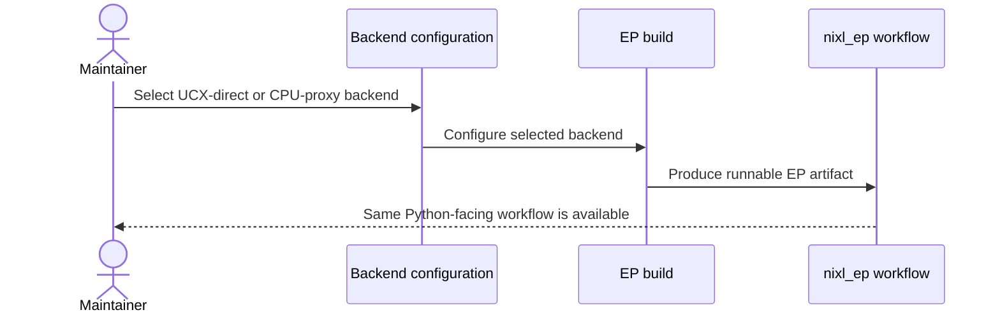
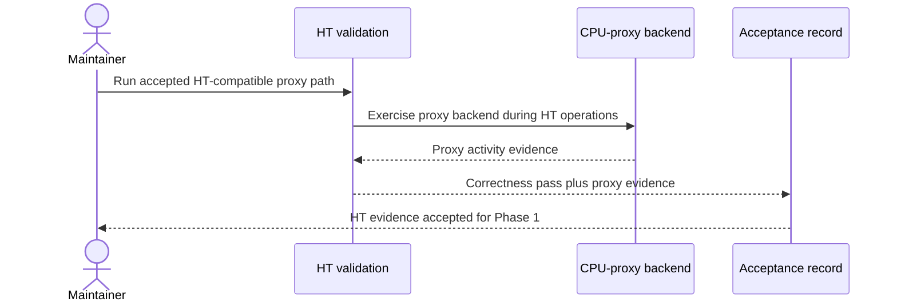
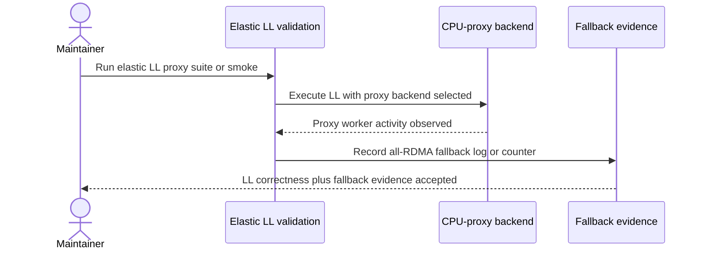
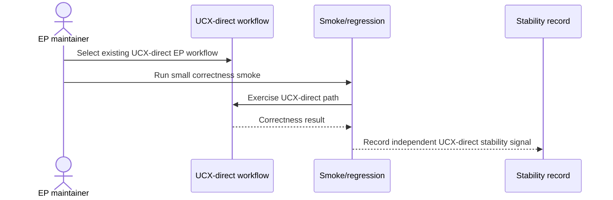
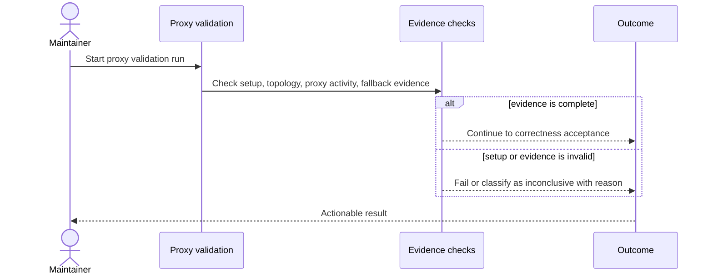

# Use Cases
> 001-integrate-nixl-ep-with-nixl-cp | feature | high-verb

## UC Table
| ID | Name | Actor | Intent | Trigger | Outcome |
|---|---|---|---|---|---|
| UC-1 | Build EP for UCX-direct or CPU-proxy backend | NIXL CPU proxy maintainer | Produce runnable EP builds for the selected backend while preserving the existing EP Python-facing workflow. | The maintainer configures and builds EP for either UCX-direct or CPU-proxy mode. | The proxy build is runnable, the UCX-direct build remains stable, and the `nixl_ep` workflow/module identity is unchanged. |
| UC-2 | Validate HT correctness through CPU proxy | EP maintainer or NIXL CPU proxy maintainer | Prove HT correctness when EP device operations are routed through the CPU-proxy backend. | The maintainer runs HT with an accepted HT-compatible proxy topology or smoke path. | HT correctness passes and evidence shows the CPU-proxy backend path was exercised. |
| UC-3 | Validate elastic LL correctness through CPU-proxy all-RDMA fallback | EP maintainer or NIXL CPU proxy maintainer | Prove elastic LL correctness through the accepted proxy all-RDMA fallback. | The maintainer runs the elastic LL suite, or an accepted elastic LL smoke, against the proxy build. | Elastic LL correctness passes and validation captures proxy selection, proxy worker activity, and explicit all-RDMA fallback evidence. |
| UC-4 | Preserve UCX-direct correctness | EP maintainer | Confirm that proxy integration did not regress the existing UCX-direct EP workflow. | The maintainer runs a small UCX-direct smoke/regression after proxy integration work. | UCX-direct correctness remains green independently of any deferred UCX-direct versus CPU-proxy comparison artifact. |
| UC-5 | Fail clearly on invalid proxy validation setup | EP maintainer or NIXL CPU proxy maintainer | Prevent invalid, accidental, or inconclusive runs from being accepted as Phase 1 proxy evidence. | The maintainer runs proxy validation with insufficient channels, missing proxy setup, unsupported topology, missing fallback evidence, or timeout-prone settings. | The run fails or is classified as inconclusive with an actionable reason, without silently passing, falling back to UCX-direct, skipping proxy activity, or hanging indefinitely. |

## Appendix

### UC-1: Build EP for UCX-direct or CPU-proxy backend
Appendix target: 10-16 lines for this UC.

**Detailed scenario:** User story: As a NIXL CPU proxy maintainer, I want to build the existing EP example for either UCX-direct or CPU-proxy mode so that Phase 1 can compare correctness boundaries without redesigning the EP user entry point. The observable postcondition is a runnable selected-backend EP build that keeps the `nixl_ep` module identity stable.

**Preconditions:** The project uses the existing backend-selection workflow; Phase 1 uses existing NIXL GPU Device API proxy, CUDA device-linking support, UCX backend/provider, and EP test environment; no new third-party dependency is expected.

**Main flow:**
- Maintainer selects the UCX-direct or CPU-proxy backend using the existing project backend configuration.
- System builds EP for the selected backend without changing the Python-facing module name or workflow.
- For proxy mode, system exposes enough proxy channels for EP logical lanes and uses one proxy worker for Phase 1.
- Maintainer receives a runnable EP artifact for the selected backend.
- Alternate flow: maintainer builds UCX-direct mode and obtains the existing stable workflow for baseline correctness smoke.

**Acceptance criteria:**
- Proxy mode can be configured and built into a runnable EP workflow.
- UCX-direct mode still builds and remains available through the same `nixl_ep` user-facing identity.
- Phase 1 does not introduce a redesigned EP entry point or new third-party dependency.
- Proxy-channel sizing covers EP logical lanes; the candidate formula `max(num_sms / 2, num_local_experts)` remains subject to architecture verification and override rules.
- Build success alone is not Phase 1 acceptance unless later HT and elastic LL validation provide proxy-path evidence.
**Sequence:**

**Error cases:**
- `UC1-UNSUPPORTED-BACKEND`: If the selected backend cannot build EP, the build fails with an actionable reason instead of producing a partial artifact.
- `UC1-ENTRYPOINT-DRIFT`: If the workflow requires a renamed module or redesigned user entry point, the result does not satisfy Phase 1 constraints.
- `UC1-INSUFFICIENT-CHANNELS`: If proxy channels cannot cover EP logical lanes, the proxy build is invalid for Phase 1 validation.

### UC-2: Validate HT correctness through CPU proxy
Appendix target: 10-16 lines for this UC.

**Detailed scenario:** User story: As an EP maintainer, I want to run HT through an accepted CPU-proxy validation path so that HT correctness evidence proves the intended proxy backend path, not only the existing UCX-direct path. The known true single-node HT fallback is not valid evidence unless a compatible smoke/test change explicitly makes it runnable under current HT constraints.

**Preconditions:** A proxy EP build exists; the proxy backend path is configured; the validation topology or smoke path is explicitly accepted for Phase 1 HT evidence; the run is manual maintainer validation, not CI or scheduler-triggered validation.

**Main flow:**
- Maintainer starts the accepted HT-compatible proxy smoke or topology.
- System executes HT through the proxy build.
- System records evidence that CPU-proxy backend activity occurred.
- HT correctness assertions pass.
- Postcondition: the HT run counts as Phase 1 proxy correctness evidence.
- Alternate flow: a real two-node RDMA HT run may provide direct follow-on evidence, but a full two-node comparison/performance run is not required for initial Phase 1 if another accepted smoke path is defined.

**Acceptance criteria:**
- HT exits successfully under the accepted proxy validation path.
- HT correctness assertions pass.
- Evidence shows the CPU-proxy backend path was exercised.
- A run that only proves UCX-direct behavior is not accepted as proxy HT evidence.
- A true single-node setup that violates current HT local-rank/total-rank constraints is rejected or classified as inconclusive unless an explicit compatible smoke/test path has been added.
**Sequence:**

**Error cases:**
- `UC2-MISSING-PROXY-EVIDENCE`: If HT passes but proxy activity is not observed, the result is inconclusive rather than accepted.
- `UC2-UNSUPPORTED-TOPOLOGY`: If the topology cannot satisfy current HT constraints, the result is rejected or marked validation-blocked.
- `UC2-TIMEOUT`: If the one-worker proxy model times out, the result is inconclusive unless the run uses pre-approved reduced-size criteria.

### UC-3: Validate elastic LL correctness through CPU-proxy all-RDMA fallback
Appendix target: 10-16 lines for this UC.

**Detailed scenario:** User story: As an EP maintainer, I want to run elastic LL through the CPU-proxy backend and observe the accepted all-RDMA fallback so that correctness under the proxy is proven even though proxy-side `nixlGetPtr` and NVLink/P2P restoration are deferred. The exact implementation surface for the fallback signal remains open for architecture/tasks, but the actor-visible evidence shape is required.

**Preconditions:** A proxy EP build exists; the elastic LL suite or an accepted elastic LL smoke is selected; Phase 1 accepts all-RDMA fallback only when validation captures proxy backend selection, proxy worker activity during LL, and an explicit fallback branch log/counter.

**Main flow:**
- Maintainer runs the elastic LL suite or accepted smoke against the proxy build.
- System selects the CPU-proxy backend for LL execution.
- System executes LL correctly through the accepted all-RDMA fallback.
- Validation records proxy worker activity during the LL run.
- Validation records an explicit all-RDMA fallback branch log or counter.
- Postcondition: the LL run counts as Phase 1 elastic LL correctness evidence.

**Acceptance criteria:**
- Elastic LL exits successfully and correctness checks pass.
- Validation records that the proxy backend was selected.
- Validation records proxy worker activity during LL.
- Validation records an explicit fallback branch log/counter proving the all-RDMA proxy fallback was used.
- Absence of NVLink/P2P fast-path restoration is not a Phase 1 defect when the accepted fallback evidence is present.
**Sequence:**

**Error cases:**
- `UC3-MISSING-FALLBACK-SIGNAL`: If LL passes but the fallback log/counter is absent, the result is inconclusive.
- `UC3-MISSING-PROXY-ACTIVITY`: If LL passes without observed proxy worker activity, the result is inconclusive rather than accepted.
- `UC3-FAST-PATH-EXPECTED`: If validation requires proxy-side `nixlGetPtr` or NVLink/P2P restoration, the requirement is out of Phase 1 scope.

### UC-4: Preserve UCX-direct correctness
Appendix target: 10-16 lines for this UC.

**Detailed scenario:** User story: As an EP maintainer, I want a small UCX-direct correctness smoke to remain green after proxy integration so that users of the existing EP workflow have an independent stability signal. This evidence is separate from any deferred UCX-direct versus CPU-proxy performance comparison table or plot.

**Preconditions:** A UCX-direct EP build exists through the existing workflow; proxy integration work has been applied or is being validated; the selected smoke/regression is small enough to act as correctness evidence rather than a performance campaign.

**Main flow:**
- Maintainer builds or selects the UCX-direct EP workflow.
- Maintainer runs the UCX-direct smoke/regression.
- System executes the existing UCX-direct correctness path.
- Correctness checks pass.
- Postcondition: UCX-direct stability is recorded independently of proxy performance comparison work.
- Alternate flow: later comparison artifacts may reuse UCX-direct runs, but they are not required to satisfy this use case.

**Acceptance criteria:**
- UCX-direct smoke/regression exits successfully.
- The `nixl_ep` workflow/module identity remains unchanged for UCX-direct users.
- The correctness signal is independent of proxy throughput, performance tuning, or comparison artifacts.
- Failure of this smoke blocks Phase 1 acceptance because G-002 requires UCX-direct workflow stability.
**Sequence:**

**Error cases:**
- `UC4-REGRESSION`: If the UCX-direct smoke fails after proxy integration, Phase 1 is not accepted until the regression is resolved.
- `UC4-COMPARISON-ONLY`: If the only UCX-direct evidence is embedded in a deferred performance comparison, the Phase 1 stability signal is missing.
- `UC4-WORKFLOW-DRIFT`: If UCX-direct users must change the public EP workflow, the use case fails even if the smoke passes.

### UC-5: Fail clearly on invalid proxy validation setup
Appendix target: 10-16 lines for this UC.

**Detailed scenario:** User story: As a maintainer, I want invalid proxy validation setups to fail clearly or be classified as inconclusive so that Phase 1 evidence cannot be created by accidental UCX-direct fallback, missing proxy context, unsupported topology, absent fallback evidence, or an indefinitely hanging run. Reduced-size timeout criteria are unresolved and must be defined before reduced runs count as correctness evidence.

**Preconditions:** Maintainer is attempting proxy validation for build, HT, or elastic LL; Phase 1 still targets one proxy worker with enough proxy channels for EP logical lanes; architecture/tasks have not yet defined all reduced-size timeout criteria.

**Main flow:**
- Maintainer starts a proxy validation run.
- System checks whether proxy setup, channel coverage, topology, and required evidence are present.
- If the setup is valid, system proceeds to the relevant HT or elastic LL validation flow.
- If the setup is invalid, system fails or marks the result inconclusive with an actionable reason.
- Postcondition: invalid runs are not accepted as Phase 1 proxy correctness evidence.
- Exception flow: if a run times out under the one-worker model and no pre-approved reduced configuration applies, the result is validation-blocked or inconclusive.

**Acceptance criteria:**
- Missing proxy setup, insufficient channels, unsupported topology, absent fallback evidence, or proxy-path absence cannot silently pass.
- Invalid runs produce an actionable failure or inconclusive classification.
- Validation must not silently fall back to UCX-direct, skip proxy activity, or hang indefinitely.
- Reduced-size runs count only after acceptable reduced-size configurations are defined before validation.
- Performance thresholds, proxy throughput, and UCX-direct versus CPU-proxy comparison artifacts do not decide this invalid-setup classification.
**Sequence:**

**Error cases:**
- `UC5-SILENT-UCX-FALLBACK`: If validation falls back to UCX-direct without being reported, the result is invalid.
- `UC5-CHANNEL-UNDERPROVISIONED`: If proxy channel count cannot cover EP logical lanes, the result is invalid for Phase 1.
- `UC5-REDUCED-SIZE-UNDEFINED`: If a timeout is avoided by unapproved reduced settings, the result is inconclusive until reduced-size criteria are defined.
